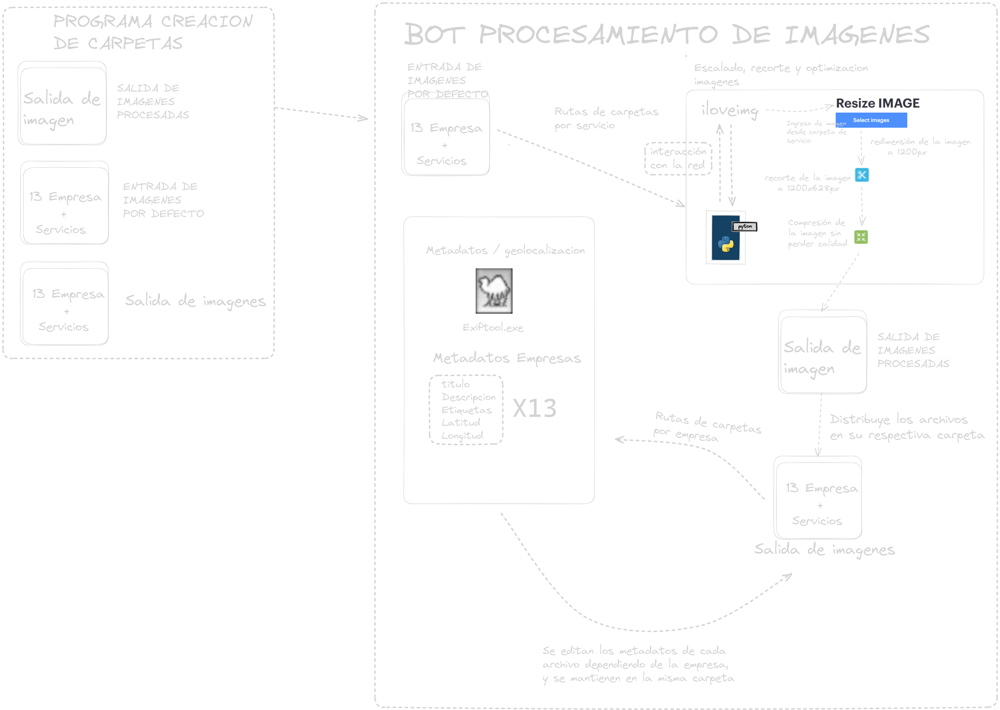

# Documentación del Programa de Redimensionamiento de Imágenes

El programa utiliza la biblioteca Selenium para automatizar la carga, redimensión, compresión y descarga de imágenes desde el sitio web "iloveimg.com". También realiza cambios en los metadatos de las imágenes.

## Resumen

El código realiza las siguientes acciones:
CREACION DE CARPETAS
1. Crea las carpetas en el sistema de archivos necesarias para el programa
BOT PAGINA
1. Abre el navegador Chrome y navega a la página web "https://www.iloveimg.com/resize-image" utilizando la biblioteca Selenium.
2. Carga una serie de imágenes ubicadas en una carpeta específica.
3. Escala cada imagen a un ancho de 1200 píxeles.
4. Corta la imagen y ajusta su altura a 628 píxeles.
5. Comprime la imagen.
6. Descarga la imagen redimensionada con las modificaciones aplicadas.
7. Repite estos pasos para cada imagen en la carpeta de imágenes.

## Uso

Para utilizar este programa, siga los siguientes pasos:

1. Asegúrese de tener las siguientes bibliotecas y recursos configurados:

   - `selenium`: para la automatización del navegador web.
   - Tener el controlador de Chrome (`chromedriver.exe`) instalado en la ubicación adecuada y configurado en las opciones de Selenium.
   - Tener el ejecutable de ExifTool (`exiftool.exe`) en la misma ubicación que el script.

2. Defina la ruta de origen de las imágenes en la variable `ruta_origen` y las rutas de destino para guardar las imágenes procesadas en la variable `rutas_destino`. El programa iterará sobre las carpetas de imágenes en la ruta de origen y realizará las operaciones necesarias.

## Componentes y Funciones

El programa consta de varias funciones que realizan acciones específicas:

### `cargar_archivo(archivo)`

Esta función recibe el nombre de un archivo y devuelve la ruta completa del archivo a cargar.

### `cargar_imagen(archivo_a_cargar)`

Esta función carga una imagen en el formulario de la página web utilizando Selenium.

### `escalar_imagen()`

Esta función ingresa un valor de ancho de 1200 píxeles en el campo correspondiente de la página web.

### `procesar_imagen()`

Esta función hace clic en el botón "Procesar" en la página web para aplicar las modificaciones a la imagen.

### `cortar_imagen()`

Esta función hace clic en el botón "Continuar recortando" en la página web para ajustar la altura de la imagen.

### `cambiar_ancho()`

Esta función cambia el valor del ancho de la imagen a 1200 píxeles.

### `cambiar_altura()`

Esta función cambia el valor de la altura de la imagen a 628 píxeles utilizando JavaScript.

### `comprimir_imagen()`

Esta función hace clic en el botón "Continuar comprimiendo" en la página web para comprimir la imagen.

### `mover_archivos_entre_carpetas(ruta_origen, ruta_destino)`

Esta funcion mueve y distribuye los archivos en sus carpetas correspondientes.

### `modify_metadata_batch(metadata_list)`

Esta funcion modifica los metadatos de todas las imagenes, que se encuentran en las rutas y sus subcarpetas.

## Flujo del Programa

1. El programa abre el navegador Chrome y accede a la página web de "iloveimg.com".

2. Itera sobre cada archivo en la carpeta de imágenes, realizando las siguientes operaciones para cada imagen:
   - Carga la imagen.
   - Escala la imagen a un ancho de 1200 píxeles.
   - Procesa la imagen.
   - Corta la imagen y ajusta la altura a 628 píxeles.
   - Cambia el ancho a 1200 píxeles nuevamente.
   - Procesa la imagen una vez más para aplicar las modificaciones.
   - Comprime la imagen.
   - Descarga la imagen redimensionada con un nombre específico.
   - Mueve y distribuye los archivos en sus carpetas correspondientes.
   - Modifica los metadatos de todas las imagenes, que se encuentran en las rutas y sus subcarpetas.
3. Después de procesar todas las imágenes, el programa cierra el navegador Chrome.

## Gestión de Errores

El programa incluye manejo de errores básico para situaciones como problemas al cargar la imagen o al hacer clic en los botones de la página web. Si ocurre algún error, se mostrará un mensaje de error específico para identificar el problema.
## Diagrama

## Conclusiones

Este programa automatiza el proceso de redimensionar imágenes de una carpeta específica utilizando el servicio en línea "iloveimg.com". Pueden ser útiles en diversas situaciones donde se requiera automatizar estas operaciones en un entorno de trabajo. Asegúrese de tener instaladas las bibliotecas y configuraciones necesarias antes de ejecutar el programa.
