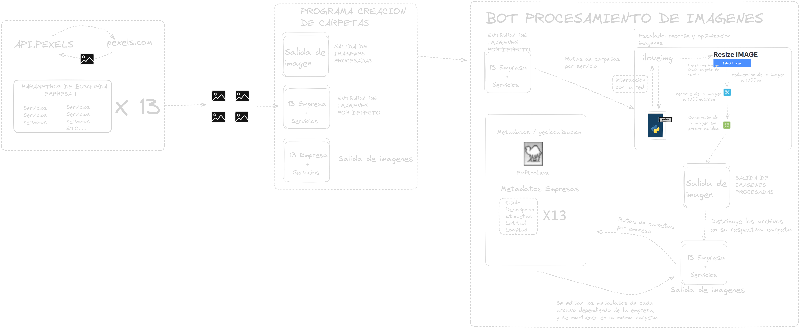

# Documentación del Programa de Redimensionamiento de Imágenes

Este documento proporciona una descripción y documentación del código Python proporcionado. El código permite redimensionar imágenes ubicadas en una carpeta específica utilizando el servicio en línea "iloveimg.com". A continuación, se presenta una descripción detallada del programa.

## Resumen

El código realiza las siguientes acciones:

1. Abre el navegador Chrome y navega a la página web "https://www.iloveimg.com/resize-image" utilizando la biblioteca Selenium.
2. Carga una serie de imágenes ubicadas en una carpeta específica.
3. Escala cada imagen a un ancho de 1200 píxeles.
4. Corta la imagen y ajusta su altura a 628 píxeles.
5. Comprime la imagen.
6. Descarga la imagen redimensionada con las modificaciones aplicadas.
7. Repite estos pasos para cada imagen en la carpeta de imágenes.

## Uso

Para utilizar este código, siga los siguientes pasos:

1. Asegúrese de tener instalado Python y las siguientes bibliotecas: Selenium y ChromeDriver. Puede descargar ChromeDriver desde [aquí](https://sites.google.com/chromium.org/driver/).

2. Modifique la ruta de la carpeta de imágenes en la variable `ruta_imagenes` para que apunte a la carpeta que contiene las imágenes que desea redimensionar.

3. Asegúrese de que la ubicación del ejecutable de ChromeDriver esté configurada correctamente en la variable `options.executable_path`. Ajuste esta ruta de acuerdo a la ubicación de su propio ChromeDriver.

4. Ejecute el código y observe cómo se redimensionan y descargan las imágenes automáticamente.

## Componentes y Funciones

El programa consta de varias funciones que realizan acciones específicas:

### `cargar_archivo(archivo)`

Esta función recibe el nombre de un archivo y devuelve la ruta completa del archivo a cargar.

### `cargar_imagen(archivo_a_cargar)`

Esta función carga una imagen en el formulario de la página web utilizando Selenium.

### `escalar_imagen()`

Esta función ingresa un valor de ancho de 1200 píxeles en el campo correspondiente de la página web.

### `procesar_imagen()`

Esta función hace clic en el botón "Procesar" en la página web para aplicar las modificaciones a la imagen.

### `cortar_imagen()`

Esta función hace clic en el botón "Continuar recortando" en la página web para ajustar la altura de la imagen.

### `cambiar_ancho()`

Esta función cambia el valor del ancho de la imagen a 1200 píxeles.

### `cambiar_altura()`

Esta función cambia el valor de la altura de la imagen a 628 píxeles utilizando JavaScript.

### `comprimir_imagen()`

Esta función hace clic en el botón "Continuar comprimiendo" en la página web para comprimir la imagen.

### `descargar_imagen(nombre_archivo)`

Esta función hace clic en el botón de descarga y descarga la imagen redimensionada con un nombre específico.

## Flujo del Programa

1. El programa abre el navegador Chrome y accede a la página web de "iloveimg.com".

2. Itera sobre cada archivo en la carpeta de imágenes, realizando las siguientes operaciones para cada imagen:
   - Carga la imagen.
   - Escala la imagen a un ancho de 1200 píxeles.
   - Procesa la imagen.
   - Corta la imagen y ajusta la altura a 628 píxeles.
   - Cambia el ancho a 1200 píxeles nuevamente.
   - Procesa la imagen una vez más para aplicar las modificaciones.
   - Comprime la imagen.
   - Descarga la imagen redimensionada con un nombre específico.

3. Después de procesar todas las imágenes, el programa cierra el navegador Chrome.

## Gestión de Errores

El programa incluye manejo de errores básico para situaciones como problemas al cargar la imagen o al hacer clic en los botones de la página web. Si ocurre algún error, se mostrará un mensaje de error específico para identificar el problema.
## Diagrama

## Conclusiones

Este programa automatiza el proceso de redimensionar imágenes de una carpeta específica utilizando el servicio en línea "iloveimg.com". Es útil cuando se necesita redimensionar varias imágenes de manera rápida y sencilla. Asegúrese de tener instaladas las bibliotecas y configuraciones necesarias antes de ejecutar el programa.
